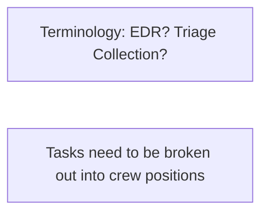
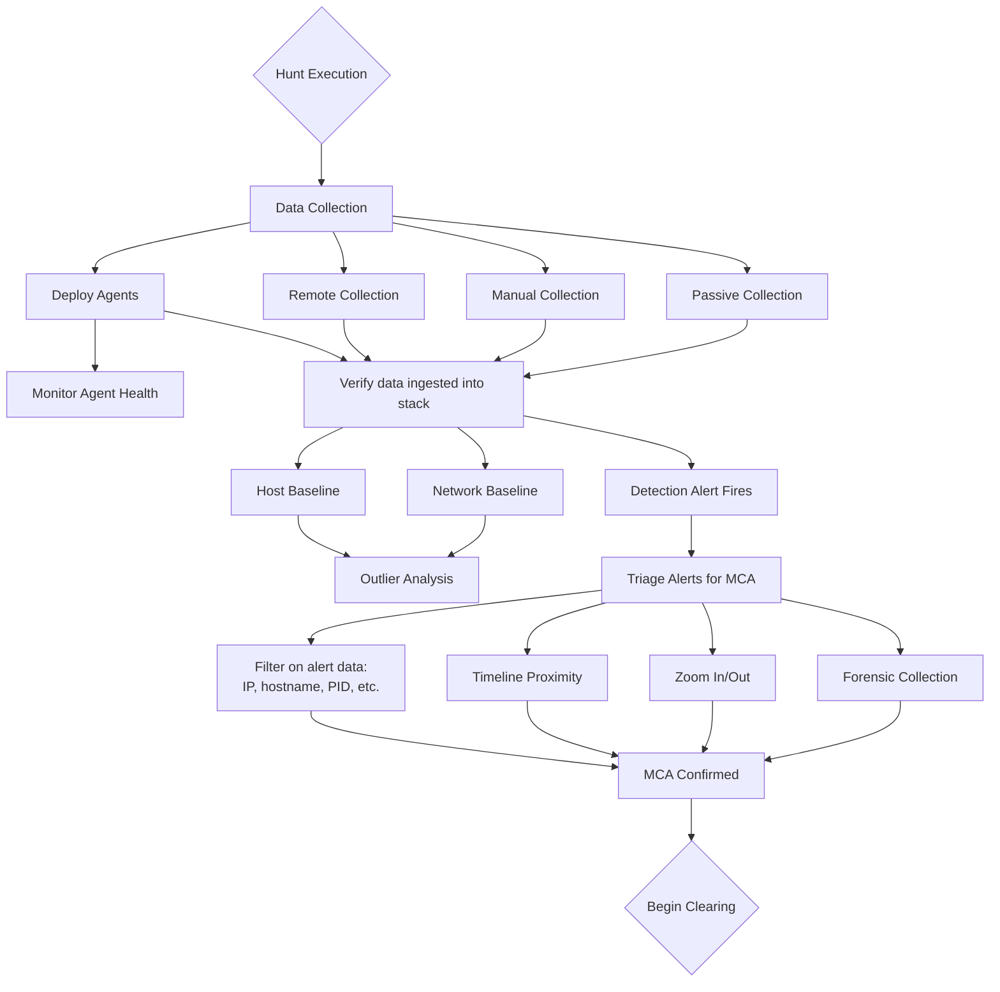

# Hunt Execution

```mermaid
flowchart LR
    A[Terminology: EDR? Triage Collection?]
    B[Tasks need to be broken out into crew positions]
```

```mermaid
flowchart TD
    HUNT_E{Hunt Execution} --> COLLECT
    COLLECT[Data Collection]
        COLLECT --> AGENTS[Deploy Agents] --> MONITOR[Monitor Agent Health]
                AGENTS --> INGEST
        COLLECT --> REMOTE[Remote Collection] --> INGEST
        COLLECT --> MANUAL[Manual Collection] --> INGEST
	COLLECT --> PASS[Passive Collection] --> INGEST
    INGEST[Verify data ingested into stack] 
        INGEST --> H_BASE
        INGEST --> N_BASE
        INGEST --> ALERT
    H_BASE[Host Baseline] --> LFA[Outlier Analysis]
    N_BASE[Network Baseline] --> LFA
    ALERT[Detection Alert Fires] --> TRIAGE
    TRIAGE[Triage Alerts for MCA]
        TRIAGE --> FILTER[Filter on alert data:<br>IP, hostname, PID, etc.]
            FILTER --> MCA[MCA Confirmed]
        TRIAGE --> PROXIMITY[Timeline Proximity]
            PROXIMITY --> MCA
        TRIAGE --> ZOOM[Zoom In/Out]
            ZOOM --> MCA
        TRIAGE --> FORENSIC[Forensic Collection]
            FORENSIC --> MCA
    MCA[MCA Confirmed] --> CLEAR1{Begin Clearing}
```