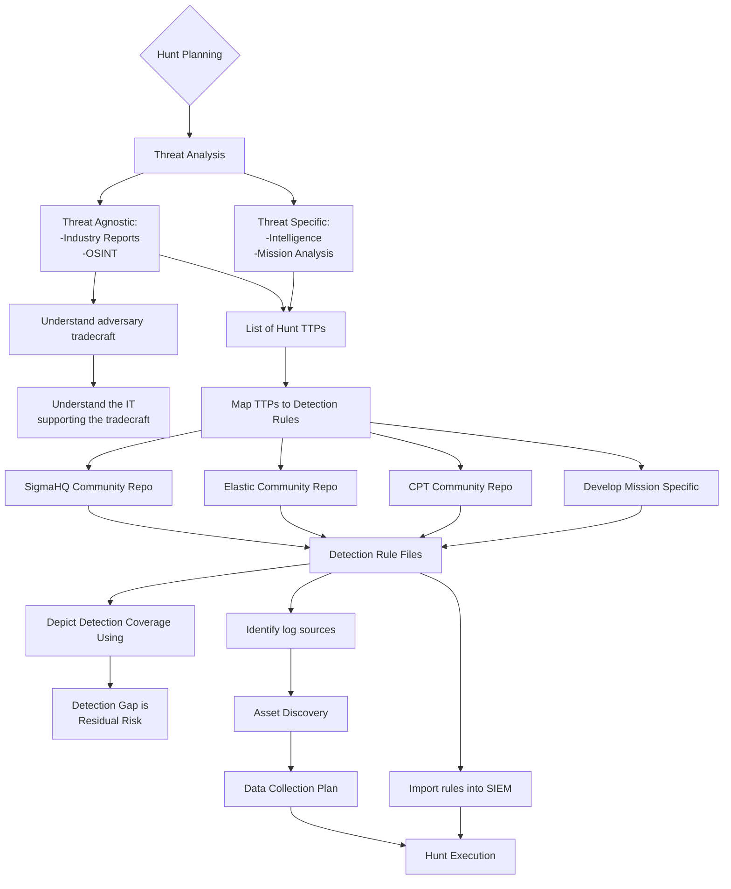

# Hunt Planning

```mermaid
flowchart TD
    HUNT_P{Hunt Planning} --> TA
    TA[Threat Analysis] 
        TA --> AGNOSTIC
        TA --> SPECIFIC
    AGNOSTIC --> TC[Understand adversary tradecraft] --> FUND[Understand the IT<br>supporting the tradecraft]
    AGNOSTIC[Threat Agnostic:<br>-Industry Reports<br>-OSINT] --> TTP
    SPECIFIC[Threat Specific:<br>-Intelligence<br>-Mission Analysis] --> TTP
    TTP[List of Hunt TTPs] --> MAP
    MAP[Map TTPs to Detection Rules] 
        MAP --> SIG
        MAP --> EL
        MAP --> CPT
        MAP --> MSN
    SIG[SigmaHQ Community Repo] --> DET
    EL[Elastic Community Repo] --> DET
    CPT[CPT Community Repo] --> DET
    MSN[Develop Mission Specific] --> DET
    DET[Detection Rule Files]
        DET --> COVERAGE[Depict Detection Coverage Using] --> GAP[Detection Gap is<br>Residual Risk] 
        DET --> LOGS[Identify log sources] --> DISC[Asset Discovery] --> COL_PLAN[Data Collection Plan] --> EXEC
        DET --> IMPORT[Import rules into SIEM] --> EXEC
    EXEC[Hunt Execution]
```